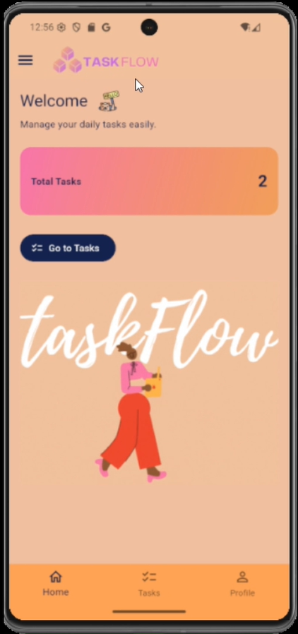

🚀 TaskFlow – Smart Task Manager App (Flutter BLoC + Local JSON + Dark/Light Theme)
## here is the data base for this application
## to use data base for more efficiante 

TaskFlow is a beautifully designed task management mobile app built using Flutter, BLoC state management, Local JSON persistence, and Custom theming (Dark & Light).
It includes stunning UI animations, gradient cards, dynamic theme-based GIFs, and modular clean folder architecture.

📌 Table of Contents

✨ Overview

🎯 Objective
📱 Screens Overview

⚙️ Features

🌓 Theme System

🎞 Animations

📂 Folder Structure

🛠 Tech Stack

📦 Project Setup

▶️ How to Run

📁 Assets

🧪 Testing

🤝 Contribution

📜 License

✨ Overview

TaskFlow is a mini assignment project built using Flutter, aimed at demonstrating:

✔ State management using Cubit (BLoC)

✔ Local storage using local JSON file

✔ Beautiful UI components

✔ Custom AppBar, Drawer, Gradient Cards

✔ Dynamic GIF-based Animation

✔ Light / Dark theme switching

✔ Clean & scalable folder structure

Perfect for showcasing Flutter development architecture, UI/UX ability, and state management flow.

🎯 Objective

The objective of TaskFlow is to:

Practice real-world app architecture

Use Local JSON as mock API

Learn BLoC/Cubit for state updates

Demonstrate reusable widgets

Showcase animation skills using GIF

Implement responsive UI

Build a scalable folder structure

📱 Screens Overview
🏠 Home Screen

Welcome header + custom hello icon

Summary card showing total tasks

Gradient-based statistics widgets

GIF based animation

Access drawer

Navigate to tasks section

📋 Task List Screen

Displays all tasks loaded from local JSON

Edit & Delete buttons

Beautiful card layout for each task

➕ Add Task Screen

Add title & description

Form validation

Auto-update to JSON using repository

✏️ Edit Task Screen

Update existing task

Delete task

Validation included

👤 Profile Screen

User avatar

Name

Description

Placeholder for future settings

☰ Custom Drawer

Profile

Settings

Theme toggle

Logout button

⚙️ Features
Feature	Description

✔ BLoC / Cubit State Management	Predictable, fast UI updates

✔ Local JSON Storage	Tasks persist inside assets/tasks.json

✔ Add / Edit / Delete Tasks	Full CRUD support

✔ Custom Home AppBar	Logo + drawer icon combo

✔ Dynamic GIF Rendering	Based on light/dark mode

✔ Animations	GIFs, transitions & smooth UI

✔ Multiple Screens	Full navigation system

✔ Error-free Validations	Safe form handling

✔ Clean Architecture	Easy to scale

🌓 Theme System

TaskFlow supports both Dark & Light theme, each with custom color styling.

🌞 Light Theme

Background: soft orange (#F87B1B)

Icon/Text Color: #11224E

Gradient cards: Pink → Orange

🌙 Dark Theme

Background: deep navy blue (#11224E)

Drawer background: full dark

Gradient cards: Pink → Gold

GIF switched automatically

final isDark = Theme.of(context).brightness == Brightness.dark;

🎞 Animations
💠 Animated GIF Switching (Theme-Based)

Theme	GIF

Light Mode	gif2.gif

Dark Mode	gife3.gif

isDark ? "assets/gif/gife3.gif" : "assets/gif/gif2.gif";

✨ Additional Animations

Card elevation hover

Smooth Page Transitions

Fade image rendering

## 🎬 Demo Video

📂 Folder Structure
lib/

│
├── main.dart

│
├── config/

│   ├── app_routes.dart

│   └── theme/

│       ├── light_theme.dart

│       ├── dark_theme.dart

│
├── data/
│   ├── models/

│   │   └── task_model.dart

│   ├── repository/

│   │   └── task_repository.dart

│   └── data_source/

│       └── local_json_loader.dart

│
├── logic/

│   └── task/

│       ├── task_cubit.dart

│       ├── task_state.dart

│
├── presentation/

│   ├── navigation/

│   │   └── bottom_nav_screen.dart

│   ├── screens/

│   │   ├── home_screen.dart

│   │   ├── task_list_screen.dart

│   │   ├── add_task_screen.dart

│   │   ├── edit_task_screen.dart

│   │   └── profile_screen.dart

│   └── widgets/
│       ├── custom_appbar.dart

│       ├── custom_home_appbar.dart

│       ├── task_item_widget.dart

│       ├── gif_widget.dart

│       └── empty_state_widget.dart

│
└── utils/

    ├── constants.dart
    
    └── validators.dart
    

assets/

├── tasks.json

├── gif/

│   ├── gif2.gif

│   └── gife3.gif

└── images/

    ├── task.png
    
    └── hello.png

🛠 Tech Stack

Technology ||   Purpose

Flutter	   |  UI Framework

Dart	   |  Programming Language

BLoC / Cubit  |	 State Management

JSON      |	  Local data storage

Material Design  |	UI Components

GIF Animation |	Visual animations

Custom Themes |	Light & Dark mode

Widget Testing  |	Basic test coverage

📦 Project Setup

Install Flutter SDK

Clone the repository:

git clone https://github.com/Gouravlamba/TaskFlow_App.git

Navigate to folder:

cd taskflow

Get dependencies:

flutter pub get

▶️ How to Run

Android / iOS

flutter run

Web
flutter run -d chrome
